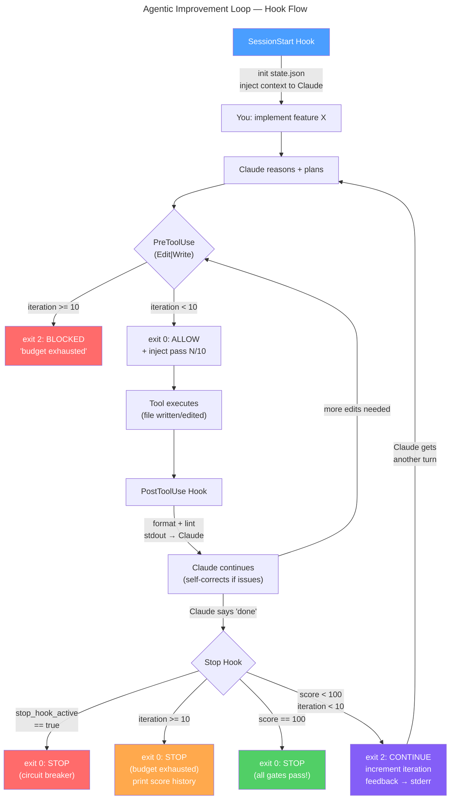

# Claude Code Native Improvement Loop, Built By Claude

A Claude Code hooks-based workflow that runs quality gates after each response
and gives Claude another turn when they fail. Up to 10 passes, then it stops.

## Architecture



## Files

```
.claude/
├── settings.json          # Hook configuration
├── hooks/
│   ├── hook-manifest.sh   # Shared hook file list (used by install, uninstall, tests)
│   ├── state-utils.sh     # State read/write functions
│   ├── session-start.sh   # Initialize state + inject context
│   ├── pre-edit-guard.sh  # Budget gate + iteration context
│   ├── post-edit-check.sh # Fast per-file quality checks
│   └── stop-improve.sh    # Improvement loop driver
└── state/
    └── loop-state.json    # Iteration counter + scores (gitignored)
tests/
└── test-suite.sh          # Shell tests for state-utils, install, uninstall
```

## Install

```bash
# From anywhere — point at your project
git clone <this-repo> /tmp/improvement-loop
cd /tmp/improvement-loop
chmod +x install.sh
./install.sh /path/to/your/project
```

Or manually copy `.claude/` into your project root.

**Requirements:** `jq`, `node`/`npm` (for the quality gates).

## Uninstall

```bash
./uninstall.sh /path/to/your/project
```

Cleanly removes hook scripts, state directory, and settings entries.
Restores your `settings.json` backup if hooks were merged.

## Usage

```bash
# Start a session — hooks load automatically
claude

# Give Claude a task
> implement a user avatar upload endpoint with validation

# Claude works. After each "done" attempt, the Stop hook:
#   - Runs typecheck, lint, tests, coverage
#   - Scores the result (0-100)
#   - If < 100: feeds failures back, Claude continues
#   - If = 100 or iteration = 10: lets Claude stop
#   - Score history is recorded: [40, 60, 80, 100]
```

## Configuration

Edit `.claude/looper.json`:
```json
{
  "max_iterations": 10,
  "gates": [
    { "name": "typecheck", "command": "npx tsc --noEmit --pretty false", "weight": 30, "skip_if_missing": "tsconfig.json" },
    { "name": "lint",      "command": "npx eslint . --ext .ts,.tsx",     "weight": 20, "skip_if_missing": "node_modules/.bin/eslint" },
    { "name": "test",      "command": "npm test",                        "weight": 30 },
    { "name": "coverage",  "command": "$LOOPER_HOOKS_DIR/check-coverage.sh", "weight": 20 }
  ]
}
```

Replace the gate commands with whatever your stack uses. Any command that exits `0` on success works.

## Circuit Breakers

Three independent exit conditions prevent runaway loops:

1. **`stop_hook_active`** — Claude tried to stop, got pushed back,
   and is trying to stop again on the same turn. Let it go.
   Without this: infinite loop.

2. **`iteration >= MAX_ITERATIONS`** — hard budget cap. The PreToolUse
   hook also enforces this by blocking further edits.

3. **`score == 100`** — all four quality gates pass. Mission complete.

## How Feedback Flows

| Hook | When | Feedback channel | Claude sees |
|------|------|-----------------|-------------|
| SessionStart | once | stdout → context | project state, loop rules |
| PreToolUse | per edit | JSON additionalContext | "Pass 3/10. Editing: src/foo.ts" |
| PostToolUse | per edit | stdout → context | per-file lint/type errors |
| Stop | per attempt | stderr → feedback | gate results + specific failures |


>
>#### Built By 
> Claude & Srdjan
>

## License

MIT
