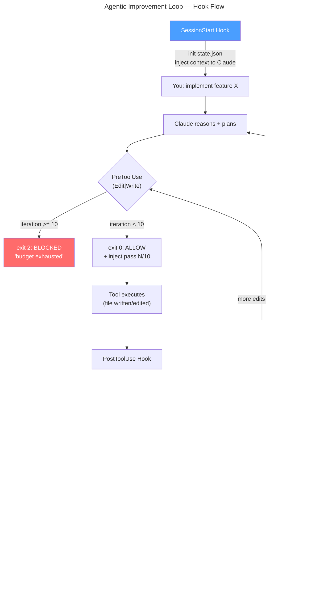

# Architecture

## System Overview

The project implements an in-session improvement loop around Claude Code hooks. The key mechanism is the Stop hook in `.claude/hooks/stop-improve.sh`:

- if the hook exits `0`, Claude is allowed to stop
- if the hook exits `2`, Claude receives feedback and gets another turn in the same session

That design keeps all work inside one Claude session rather than rebuilding state in an external supervisor.

The installed hook wiring is defined in `.claude/settings.json`:

- `SessionStart` for `new`
- `PreToolUse` for `Edit|MultiEdit|Write`
- `PostToolUse` for `Edit|MultiEdit|Write`
- `Stop`

## Hook Execution Flow



### 1. SessionStart

`.claude/hooks/session-start.sh` sources `state-utils.sh`, calls `init_state`, reads gate config from `.claude/looper.json`, and prints startup context to `stdout`.

The context includes:

- loop rules and the configured gate list with weights
- current git branch
- installed Node version
- package scripts from `package.json`
- discovered TypeScript test files

stdout from this hook becomes Claude's context for the session.

### 2. PreToolUse

`.claude/hooks/pre-edit-guard.sh` runs before `Edit`, `MultiEdit`, and `Write`.

It does three things:

- reads the current `iteration` from state
- blocks edits when `is_budget_exhausted` is true
- returns JSON with `hookSpecificOutput.additionalContext`

Concrete output shape:

```json
{
  "hookSpecificOutput": {
    "hookEventName": "PreToolUse",
    "permissionDecision": "allow",
    "additionalContext": "Improvement pass 2/10. Editing: src/foo.ts"
  }
}
```

This hook also appends the edited file path to `files_touched` if it has not been seen before.

### 3. PostToolUse

`.claude/hooks/post-edit-check.sh` runs after `Edit`, `MultiEdit`, and `Write`.

It only checks `.ts` and `.tsx` files. The goal is fast feedback before the full Stop evaluation.

Current checks:

- `prettier --check`, then silent `prettier --write`
- `eslint` on the edited file
- `tsc --noEmit --pretty false "$FILE"`

The hook writes human-readable results to `stdout`, so the next Claude turn gets immediate local feedback such as:

- `✓ src/foo.ts: format, lint, syntax all clean`
- a short list of lint or TypeScript errors

### 4. Stop

`.claude/hooks/stop-improve.sh` is the control loop.

Execution order:

1. read hook input JSON from `stdin`
2. check `stop_hook_active`
3. check iteration budget
4. load gate config from `.claude/looper.json`
5. run each gate command, pass if exit 0
6. record score and per-gate pass/fail
7. stop on perfect score or continue on imperfect score

Unlike `PostToolUse`, this hook writes its feedback to `stderr`, which is the channel used for retry-driving feedback at the end of a response.

## State Management

Shared state lives in `.claude/hooks/state-utils.sh`.

### Location

- `STATE_DIR="${CLAUDE_PROJECT_DIR:-.}/.claude/state"`
- `STATE_FILE="$STATE_DIR/loop-state.json"`

Using `CLAUDE_PROJECT_DIR` keeps the hook scripts relocatable after installation into another repository.

### Initial structure

`init_state` writes this JSON:

```json
{
  "iteration": 0,
  "max_iterations": 10,
  "scores": [],
  "checks": {},
  "status": "running",
  "files_touched": []
}
```

`checks` is populated dynamically after each Stop pass, with one key per configured gate name set to `true` or `false`.

### Lifecycle

Session start:

- `init_state` overwrites any previous loop state with a fresh file

During edits:

- `PreToolUse` appends unique file paths into `files_touched`

During Stop evaluation:

- `append_state '.scores' "$SCORE"` records each pass score
- `write_state '.checks' ...` records per-gate pass/fail for the current pass
- `increment_iteration` advances the pass counter after imperfect runs
- `write_state '.status' ...` records terminal states

Observed status values:

- `running`
- `complete`
- `budget_exhausted`
- `breaker_tripped`

`max_iterations` is read from `.claude/looper.json` at startup; both initialization and runtime budget checks use the same `MAX_ITERATIONS` shell variable.

## Gate Config

Gates are defined in `.claude/looper.json`:

```json
{
  "max_iterations": 10,
  "gates": [
    { "name": "typecheck", "command": "npx tsc --noEmit --pretty false", "weight": 30, "skip_if_missing": "tsconfig.json" },
    { "name": "lint",      "command": "npx eslint . --ext .ts,.tsx",     "weight": 20, "skip_if_missing": "node_modules/.bin/eslint" },
    { "name": "test",      "command": "npm test",                        "weight": 30 },
    { "name": "coverage",  "command": "$LOOPER_HOOKS_DIR/check-coverage.sh", "weight": 20 }
  ]
}
```

Each gate runs its `command` and passes if the command exits `0`. The loop stops early when the sum of passing weights equals the sum of all weights.

`skip_if_missing` names a file or binary path. If that path does not exist, the gate is skipped and full points are awarded (gate not applicable to this project).

`$LOOPER_HOOKS_DIR` is exported by the Stop hook before running gates and resolves to the hooks directory, so gate commands can reference helper scripts shipped alongside the hooks.

### Default coverage gate

`.claude/hooks/check-coverage.sh` reads `coverage/coverage-summary.json` (Jest/nyc format) and exits non-zero if line coverage is below 80%. Replace the command in the gate config with any tool that exits `0` when coverage is acceptable.

### Scoring

The total possible score is the sum of all gate weights. The loop treats a result equal to that total as complete. There is no partial credit: a gate either passes (full weight) or fails (zero).

## Circuit Breakers

The loop has three separate stop conditions.

### `stop_hook_active`

The Stop hook reads `.stop_hook_active` from its input JSON.

If this value is `true`:

- state is updated to `breaker_tripped`
- the hook exits `0`

This prevents infinite re-entry if Claude is already being pushed back by the Stop hook on the same turn.

### Iteration budget

The budget is read from `max_iterations` in `.claude/looper.json` at startup. The hooks fall back to `10` if the field is absent.

Enforcement points:

- `PreToolUse` blocks further edits when the budget is exhausted and exits `2`
- `Stop` exits `0` with a final budget summary when `iteration >= MAX_ITERATIONS`

### Perfect score

If the total score reaches the sum of all gate weights, the Stop hook:

- writes `status = "complete"`
- prints a completion summary with score history
- exits `0`

## Feedback Channels

The loop uses different output channels for different kinds of feedback.

### `stdout`

Used by `SessionStart` and `PostToolUse` for context seeding and fast edit-local feedback.

### `stderr`

Used by `PreToolUse` when blocking edits and by `Stop` for pass summaries, failures, urgency coaching, and terminal summaries.

### `additionalContext`

Used by `PreToolUse` to inject a lightweight pass/file reminder into Claude's context without relying on error output.

## Exit Code Semantics

- `0`: allow the session to stop or the tool action to proceed
- `2`: continue the loop or block the current action with feedback

Concrete usage:

- `Stop` exits `0` for breaker, perfect completion, or budget exhaustion
- `Stop` exits `2` after an imperfect pass so Claude gets another turn
- `PreToolUse` exits `2` when the edit budget is exhausted
- `SessionStart` and `PostToolUse` normally exit `0`

## Extension Points

### Change gate commands or weights

Edit `.claude/looper.json`. No hook scripts need to change. Replace commands with whatever your stack uses. Any command that exits `0` on success works.

### Add a coverage helper

`.claude/hooks/check-coverage.sh` is the default coverage gate. Replace its command in `looper.json` with any script or tool that exits non-zero when coverage is below your threshold. `$LOOPER_HOOKS_DIR` resolves to the hooks directory at runtime.

### Tighten or relax fast edit checks

Edit `.claude/hooks/post-edit-check.sh` to support additional file types, disable auto-formatting, or add file-local validators.

### Add fields to state

Edit `.claude/hooks/state-utils.sh` to add new fields to `loop-state.json` or change terminal status values.

### Adjust startup context

Edit `.claude/hooks/session-start.sh` to inject repo-specific constraints, architecture notes, or project commands beyond `package.json` scripts.

### Rewire hook matchers

Edit `.claude/settings.json` to change tool matchers, add commands on the same hook event, or narrow the trigger surface.
