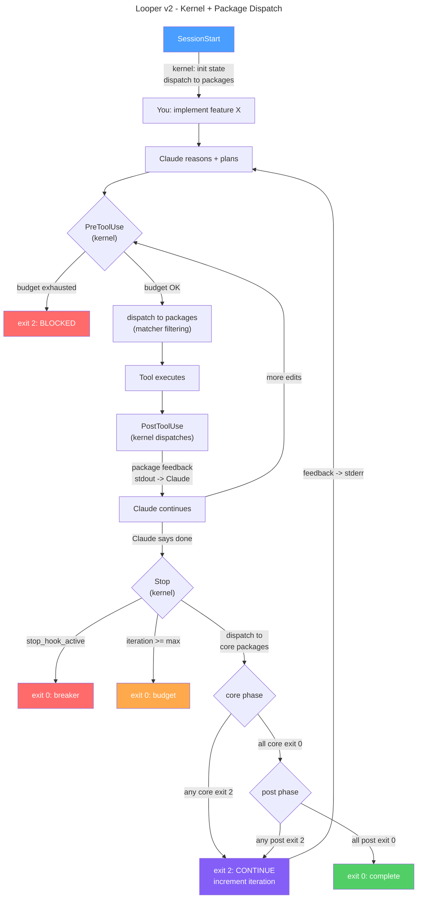

# Architecture

## System Overview

Looper is a package-based improvement loop for Claude Code. It consists of two layers:

1. **Kernel**: a minimal dispatcher (`kernel.sh` + `pkg-utils.sh`) that manages loop state, circuit breakers, and hook dispatch. It knows nothing about quality gates or specific behaviors.

2. **Packages**: directories containing handler scripts that define what happens at each hook event. The bundled `quality-gates` package implements gate evaluation, scoring, per-file checks, and coaching.

The kernel is registered via the plugin's `hooks/hooks.json`. It receives hook events from Claude Code and dispatches to active package handlers.

## Hook Execution Flow



## Kernel

### Entry Point

A single script: `kernel/kernel.sh <event>`. The event name is the first argument: `SessionStart`, `PreToolUse`, `PostToolUse`, or `Stop`.

### Plugin Hook Wiring

Hook registration is defined in `hooks/hooks.json` using the `${CLAUDE_PLUGIN_ROOT}` variable:

```json
{
  "hooks": {
    "SessionStart": [{ "matcher": "new", "hooks": [{ "type": "command", "command": "bash \"${CLAUDE_PLUGIN_ROOT}/kernel/kernel.sh\" SessionStart" }] }],
    "PreToolUse":   [{ "hooks": [{ "type": "command", "command": "bash \"${CLAUDE_PLUGIN_ROOT}/kernel/kernel.sh\" PreToolUse" }] }],
    "PostToolUse":  [{ "hooks": [{ "type": "command", "command": "bash \"${CLAUDE_PLUGIN_ROOT}/kernel/kernel.sh\" PostToolUse" }] }],
    "Stop":         [{ "hooks": [{ "type": "command", "command": "bash \"${CLAUDE_PLUGIN_ROOT}/kernel/kernel.sh\" Stop", "timeout": 600 }] }]
  }
}
```

PreToolUse and PostToolUse register with no matcher (receives all tool events). The kernel filters internally using each package's `matchers` field.

### Kernel Responsibilities

- **State lifecycle**: iteration counter, budget enforcement, status tracking
- **Circuit breakers**: `stop_hook_active` re-entry guard, iteration budget cap
- **Hook dispatch**: resolve packages, call handlers in order, aggregate results
- **Package loading**: read `packages` array from `looper.json`, resolve directories
- **Shared state**: `files_touched` array, maintained in kernel.json

### What the Kernel Does NOT Own

Scoring, gate evaluation, coaching messages, context injection content, post-edit checks, discovery commands. All domain logic lives in packages.

## State Management

### Layout

```
.claude/state/
  kernel.json                 # kernel-owned: iteration, status, files_touched
  quality-gates/
    state.json                # package-owned: scores, checks, gate results
  security-audit/
    state.json                # package-owned: findings, scan results
```

### Kernel State

```json
{
  "iteration": 0,
  "max_iterations": 10,
  "status": "running",
  "files_touched": []
}
```

Status values: `running`, `complete`, `budget_exhausted`, `breaker_tripped`.

### Package State

Each package owns its state directory and file entirely. Packages read/write via `pkg_state_read` and `pkg_state_write` from `pkg-utils.sh`. Packages can read other packages' state (read-only) via `pkg_read`.

## Package Format

A package is a directory with a `package.json` manifest and optional handler scripts.

### Directory Structure

```
packages/<name>/
  package.json          # manifest (required)
  hooks/
    session-start.sh    # SessionStart handler (optional)
    pre-tool-use.sh     # PreToolUse handler (optional)
    post-tool-use.sh    # PostToolUse handler (optional)
    stop.sh             # Stop handler (optional)
  lib/                  # helper scripts (optional)
  skills/               # SKILL.md files (optional)
  defaults.json         # default config (optional)
```

Convention over configuration: if a handler file exists, the kernel calls it. No registration needed.

### Manifest

```json
{
  "name": "quality-gates",
  "version": "2.0.0",
  "description": "Quality gate loop",
  "matchers": {
    "PreToolUse": "Edit|MultiEdit|Write",
    "PostToolUse": "Edit|MultiEdit|Write"
  },
  "phase": "core",
  "skills": ["skills/looper-config"]
}
```

- `matchers`: regex patterns for PreToolUse/PostToolUse tool name filtering. Absent means "all tools".
- `phase`: `"core"` (default) or `"post"`. Controls when the package's stop handler is evaluated.
- `skills`: relative paths to skill directories to install.

### Handler Protocol

Handlers receive hook input JSON on stdin and environment variables set by the kernel.

| Hook | stdout | stderr | exit 0 | exit 2 |
|------|--------|--------|--------|--------|
| SessionStart | Context injected into Claude | Ignored | Normal | N/A |
| PreToolUse | JSON with additionalContext | Warning messages | Allow tool | Block tool |
| PostToolUse | Feedback to Claude | Ignored | Normal | N/A |
| Stop | Ignored | Feedback to Claude | Vote "done" | Vote "continue" |

## Stop Condition Protocol

### Two-Phase Model

Packages declare a phase in their manifest:

- **core** (default): runs every stop evaluation
- **post**: runs only after ALL core packages are satisfied

### Aggregation Algorithm

1. Check circuit breakers (kernel-level)
2. Run all core-phase stop handlers
3. If any core handler exits 2: kernel exits 2, post handlers are skipped
4. If all core handlers exit 0: run all post-phase stop handlers
5. If any post handler exits 2: kernel exits 2
6. If all handlers exit 0: kernel exits 0, loop complete

Packages without a `hooks/stop.sh` are implicitly satisfied and never block the loop.

### Output Aggregation

When multiple packages provide stderr feedback, the kernel adds package-name headers:

```
-- [quality-gates] --
  x typecheck: failed (0/30)
  v test: pass (70/70)

-- [security-audit] --
  Found 2 high-severity vulnerabilities
```

## Package Discovery

Search path (first match wins per package name):

1. `$CLAUDE_PROJECT_DIR/.claude/packages/<name>/` - project-local override
2. `$HOME/.claude/packages/<name>/` - user-global
3. `$CLAUDE_PLUGIN_ROOT/packages/<name>/` - bundled with the plugin

A project can override a bundled package by creating a same-named directory in `.claude/packages/`.

## Configuration

### looper.json Format

```json
{
  "max_iterations": 10,
  "packages": ["quality-gates"],
  "quality-gates": {
    "gates": [...],
    "checks": [...]
  }
}
```

Top-level `max_iterations` and `packages` are kernel config. Everything under a package name key is that package's config, passed through by the kernel.

### Multi-Package Configuration

```json
{
  "max_iterations": 15,
  "packages": ["quality-gates", "security-audit"],
  "quality-gates": { "gates": [...] },
  "security-audit": { "scan_command": "npm audit --json", "severity_threshold": "high" }
}
```

Package order in the array determines execution order within the same phase.

## Circuit Breakers

### stop_hook_active

Prevents infinite re-entry. If Claude was pushed back by the Stop hook and tries to stop again on the same turn, the kernel exits 0 immediately. Status: `breaker_tripped`.

### Iteration Budget

Hard cap at `max_iterations`. The kernel checks this both in the Stop dispatcher (exits 0 with summary) and in PreToolUse (blocks edits, exits 2). Status: `budget_exhausted`.

### All Packages Satisfied

When all packages' stop handlers exit 0 (across both phases), the kernel exits 0. Status: `complete`.

## Exit Code Semantics

- `0`: allow (stop the loop, permit the tool action, continue normally)
- `2`: continue (push Claude back into the loop, block the tool action)

## Plugin Layout

```
looper/                              # plugin root
  .claude-plugin/
    plugin.json                      # plugin manifest
  hooks/
    hooks.json                       # hook registrations
  skills/
    looper-config/                   # /looper:looper-config skill
  commands/
    bootstrap.md                     # /looper:bootstrap command
  kernel/
    kernel.sh                        # kernel dispatcher
    pkg-utils.sh                     # state/config helpers
  packages/
    quality-gates/                   # bundled package
```

## Project Runtime Layout

After the kernel's first-run bootstrap:

```
your-project/
  .claude/
    looper.json                      # project config (created by ensure_config)
    state/
      kernel.json                    # kernel state
      quality-gates/
        state.json                   # package state
```
