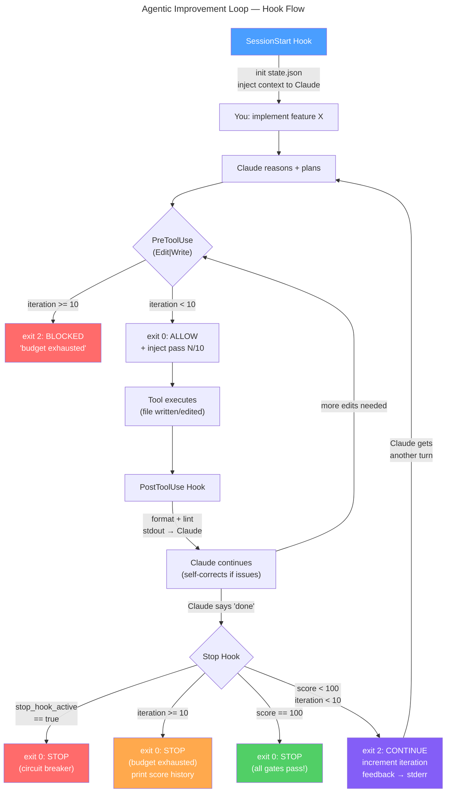

# Architecture

## System Overview

The project implements an in-session improvement loop around Claude Code hooks. The key mechanism is the Stop hook in [`.claude/hooks/stop-improve.sh`](/Users/srdjans/Code/improvement-loop/.claude/hooks/stop-improve.sh):

- if the hook exits `0`, Claude is allowed to stop
- if the hook exits `2`, Claude receives feedback and gets another turn in the same session

That design keeps all work inside one Claude session instead of rebuilding state in an external supervisor. The project description in [`blog-post.md`](/Users/srdjans/Code/improvement-loop/blog-post.md) calls this out explicitly as the reason the loop can stay "in session" while preserving the full working context.

The installed hook wiring is defined in [`.claude/settings.json`](/Users/srdjans/Code/improvement-loop/.claude/settings.json):

- `SessionStart` for `new`
- `PreToolUse` for `Edit|MultiEdit|Write`
- `PostToolUse` for `Edit|MultiEdit|Write`
- `Stop`

## Hook Execution Flow



### 1. SessionStart

[`.claude/hooks/session-start.sh`](/Users/srdjans/Code/improvement-loop/.claude/hooks/session-start.sh) sources [`state-utils.sh`](/Users/srdjans/Code/improvement-loop/.claude/hooks/state-utils.sh), calls `init_state`, and prints startup context to `stdout`.

The context currently includes:

- loop rules and default gates
- current git branch
- installed Node version
- package scripts from `package.json`
- discovered TypeScript test files

Because `stdout` from this hook becomes Claude context, this is the initial prompt-shaping layer for the loop.

### 2. PreToolUse

[`.claude/hooks/pre-edit-guard.sh`](/Users/srdjans/Code/improvement-loop/.claude/hooks/pre-edit-guard.sh) runs before `Edit`, `MultiEdit`, and `Write`.

It does three things:

- reads the current `iteration` from state
- blocks edits when `is_budget_exhausted` is true
- returns JSON with `hookSpecificOutput.additionalContext`

Concrete output shape:

```json
{
  "hookSpecificOutput": {
    "hookEventName": "PreToolUse",
    "permissionDecision": "allow",
    "additionalContext": "Improvement pass 2/10. Editing: src/foo.ts"
  }
}
```

This hook also appends the edited file path to `files_touched` if it has not been seen before.

### 3. PostToolUse

[`.claude/hooks/post-edit-check.sh`](/Users/srdjans/Code/improvement-loop/.claude/hooks/post-edit-check.sh) runs after `Edit`, `MultiEdit`, and `Write`.

It only checks `.ts` and `.tsx` files. The goal is fast feedback, not full project validation.

Current checks:

- `prettier --check`, then silent `prettier --write`
- `eslint` on the edited file
- `tsc --noEmit --pretty false "$FILE"`

The hook writes human-readable results to `stdout`, which means the next Claude turn gets immediate, local feedback such as:

- `✓ src/foo.ts: format, lint, syntax all clean`
- a short list of lint or TypeScript errors

### 4. Stop

[`.claude/hooks/stop-improve.sh`](/Users/srdjans/Code/improvement-loop/.claude/hooks/stop-improve.sh) is the control loop.

Execution order:

1. read hook input JSON from `stdin`
2. check `stop_hook_active`
3. check iteration budget
4. run quality gates
5. record score and partial gate state
6. stop on perfect score or continue on imperfect score

Unlike `PostToolUse`, this hook writes its feedback to `stderr`. In this project, `stderr` is the channel used for retry-driving feedback at the end of a response.

## State Management

Shared state lives in [`.claude/hooks/state-utils.sh`](/Users/srdjans/Code/improvement-loop/.claude/hooks/state-utils.sh).

### Location

- `STATE_DIR="${CLAUDE_PROJECT_DIR:-.}/.claude/state"`
- `STATE_FILE="$STATE_DIR/loop-state.json"`

Using `CLAUDE_PROJECT_DIR` keeps the hook scripts relocatable after installation into another repository.

### Initial structure

`init_state` writes this JSON:

```json
{
  "iteration": 0,
  "max_iterations": 10,
  "scores": [],
  "checks": {
    "typecheck": null,
    "lint": null,
    "test": null,
    "coverage": null
  },
  "status": "running",
  "files_touched": []
}
```

### Lifecycle

Session start:

- `init_state` overwrites any previous loop state with a fresh file

During edits:

- `PreToolUse` appends unique file paths into `files_touched`

During Stop evaluation:

- `append_state '.scores' "$SCORE"` records each pass score
- `increment_iteration` advances the pass counter after imperfect runs
- `write_state '.status' ...` records terminal states

Observed status values in the current implementation:

- `running`
- `complete`
- `budget_exhausted`
- `breaker_tripped`

Implementation note:

- `checks.typecheck`, `checks.lint`, and `checks.test` are updated by `stop-improve.sh`
- `checks.coverage` is initialized in state but is not currently written back after evaluation
- `max_iterations` is written as a literal `10` during initialization, while runtime budget checks use `MAX_ITERATIONS` from the shell script

## Quality Gates And Scoring

The Stop hook uses a `100` point model:

- typecheck: `30`
- lint: `20`
- test: `30`
- coverage: `20`

### Typecheck

Condition:

- if `tsconfig.json` exists, run `npx tsc --noEmit --pretty false`
- if no TypeScript errors are found, award `30`
- if `tsconfig.json` is missing, skip the gate and still award `30`

Failure details:

- the hook captures up to 10 `error TS` lines

### Lint

Condition:

- if `node_modules/.bin/eslint` exists, run `npx eslint . --ext .ts,.tsx --format compact`
- if no compact-format errors are found, award `20`
- if ESLint is missing, skip the gate and still award `20`

Failure details:

- the hook scans for `: Error -` lines and includes up to 10 of them

### Test

Condition:

- if `package.json` contains `scripts.test`, run `npm test -- --reporter=dot`
- otherwise, award `0` and emit a "No test script found" failure

Failure detection uses both exit code and output:

- exit status is captured via `if/then/else` so a non-zero exit registers as failure
- output is also scanned for common failure markers: `FAIL`, `✗`, `✘`, `×`, `failed`

Failure details:

- the hook appends the last 20 lines of test output

### Coverage

Condition:

- read `coverage/coverage-summary.json`
- inspect `.total.lines.pct`
- `80%` or higher awards the full `20`
- below `80%` awards proportional partial credit
- missing coverage data awards `0`

Proportional scoring formula:

```text
floor(line_coverage * 20 / 80)
```

Example:

- `72%` coverage becomes `18/20`

Failure details:

- the hook reports current line coverage and the `80%` target
- it lists up to 5 files below the threshold when `coverage-summary.json` contains per-file entries

## Circuit Breakers

The loop has three separate stop conditions.

### `stop_hook_active`

The Stop hook reads `.stop_hook_active` from its input JSON.

If this value is `true`:

- state is updated to `breaker_tripped`
- the hook prints `Stop hook breaker: allowing stop on re-entry.`
- the hook exits `0`

This prevents infinite re-entry if Claude is already being pushed back by the Stop hook on the same turn.

### Iteration budget

The hard budget is defined by `MAX_ITERATIONS=10` in [`.claude/hooks/state-utils.sh`](/Users/srdjans/Code/improvement-loop/.claude/hooks/state-utils.sh).

Enforcement points:

- `PreToolUse` blocks future edits when the budget is exhausted and exits `2`
- `Stop` exits `0` with a final budget summary when `iteration >= MAX_ITERATIONS`

### Perfect score

If the total score reaches `100`, the Stop hook:

- writes `status = "complete"`
- prints a completion summary with score history
- exits `0`

## Feedback Channels

The loop deliberately uses different output channels for different kinds of feedback.

### `stdout`

Used by:

- `SessionStart`
- `PostToolUse`

Purpose:

- context seeding
- fast edit-local feedback

### `stderr`

Used by:

- `PreToolUse` when blocking edits
- `Stop` for pass summaries, failures, urgency coaching, and terminal summaries

Purpose:

- turn-ending feedback that should shape the next iteration

### `additionalContext`

Used by:

- `PreToolUse`

Purpose:

- inject a lightweight pass/file reminder into Claude’s context without relying on error output

## Exit Code Semantics

The loop relies on Claude Code hook exit codes as control flow.

- `0`: allow the session to stop or the tool action to proceed
- `2`: continue the loop or block the current action with feedback

Concrete usage in this project:

- `Stop` exits `0` for breaker, perfect completion, or budget exhaustion
- `Stop` exits `2` after an imperfect pass so Claude gets another turn
- `PreToolUse` exits `2` when the edit budget is exhausted
- `SessionStart` and `PostToolUse` normally exit `0`

## Extension Points

The current design is intentionally simple and shell-driven. The main customization seams are straightforward.

### Add or change gates

Edit [`.claude/hooks/stop-improve.sh`](/Users/srdjans/Code/improvement-loop/.claude/hooks/stop-improve.sh) to:

- replace the default commands
- add new gates such as build, security scan, or domain-specific validation
- change gate weights or stop criteria

### Tighten or relax fast edit checks

Edit [`.claude/hooks/post-edit-check.sh`](/Users/srdjans/Code/improvement-loop/.claude/hooks/post-edit-check.sh) to:

- support additional file types
- disable auto-formatting
- add file-local validators

### Change loop budget or state shape

Edit [`.claude/hooks/state-utils.sh`](/Users/srdjans/Code/improvement-loop/.claude/hooks/state-utils.sh) to:

- raise or lower `MAX_ITERATIONS`
- add new fields to `loop-state.json`
- change terminal status values

### Adjust startup context

Edit [`.claude/hooks/session-start.sh`](/Users/srdjans/Code/improvement-loop/.claude/hooks/session-start.sh) to inject:

- repo-specific constraints
- architecture notes
- project commands beyond `package.json` scripts

### Rewire hook matchers

Edit [`.claude/settings.json`](/Users/srdjans/Code/improvement-loop/.claude/settings.json) if you want:

- different tool matchers
- extra commands on the same hook event
- a narrower or broader trigger surface
